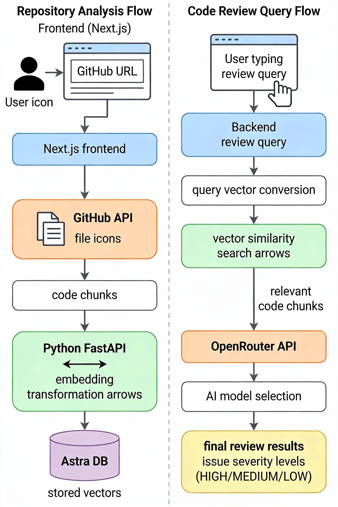
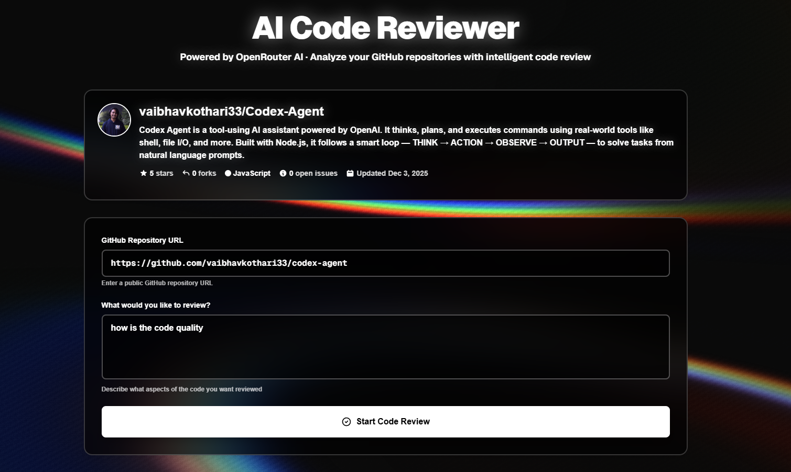
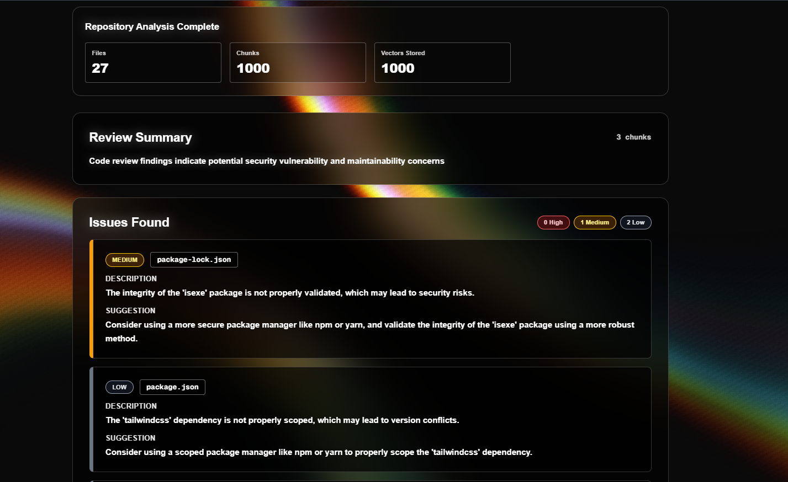

# 🤖 AI Code Reviewer

<div align="center">


**An intelligent AI-powered code review system that analyzes GitHub repositories using vector embeddings and AI models**

[Features](#-features) • [Tech Stack](#-tech-stack) • [Setup](#️-setup) • [Usage](#-usage) • [API](#-api-endpoints)

</div>

---

## 📖 What It Does

AI Code Reviewer is a comprehensive code analysis tool that automatically reviews GitHub repositories using advanced AI technology. Here's how it works:

1. **Repository Analysis**: Fetches code files from any public GitHub repository
2. **Smart Chunking**: Intelligently breaks down code into contextually meaningful chunks with overlapping lines for better context preservation
3. **Vector Embeddings**: Converts code chunks into high-dimensional vector representations using machine learning models
4. **Vector Storage**: Stores embeddings in a vector database (Astra DB) for fast similarity search
5. **Semantic Search**: When you ask a question, it finds the most relevant code sections using vector similarity search
6. **AI Review**: Uses advanced AI models (via OpenRouter) to analyze the code and provide detailed feedback, including:
   - Security vulnerabilities
   - Code quality issues
   - Best practice violations
   - Performance optimizations
   - Bug detection
   - Architecture suggestions

The system provides structured reviews with severity levels (HIGH, MEDIUM, LOW) and actionable suggestions for each issue found.

### 🎯 FlowChart





*Add your demo screenshot above showing the application interface, repository analysis, and review results*

## 🚀 Features

- ✅ **Intelligent Code Analysis**: Automatically fetches and analyzes GitHub repositories
- ✅ **Smart Chunking**: Breaks code into contextually meaningful chunks with overlap for context preservation
- ✅ **Vector Search**: Uses semantic embeddings to find relevant code sections based on meaning, not just keywords
- ✅ **AI-Powered Reviews**: Leverages multiple AI models (Llama, Gemini, Claude) via OpenRouter for intelligent code review
- ✅ **Modern UI**: Beautiful, responsive frontend with animated background, real-time progress tracking, and dark theme
- ✅ **Repository Metadata**: Displays GitHub repository information (stars, forks, languages, topics)
- ✅ **Structured Output**: Provides categorized issues with severity levels and actionable suggestions
- ✅ **Memory Optimized**: Processes large repositories efficiently with batch processing and incremental loading
- ✅ **Error Handling**: Comprehensive error handling and validation throughout the entire pipeline
- ✅ **Scalable Architecture**: Microservices-based design with separate embedding service for better performance

## 🛠️ Tech Stack

### Frontend
-  - React framework for production
-  - UI library
-  - Type-safe JavaScript
-  - Utility-first CSS framework
-  - 3D graphics for animated background

### Backend
-  - JavaScript runtime
-  - Web framework
-  - HTTP client

### Embedding Service
-  - Programming language
-  - Modern Python web framework
-  - Pre-trained embedding models
-  - ASGI server

### Vector Database
-  - DataStax Astra DB for vector storage and similarity search

### AI Services
-  - Unified API for multiple AI models
-  - Google's AI model (via OpenRouter)
-  - Meta's Llama model (via OpenRouter)
-  - Anthropic's Claude model (via OpenRouter)

### APIs & Services
-  - Repository file fetching and metadata

### Development Tools
-  - Code linting
-  - Code formatting

## 📋 Prerequisites

- **Node.js** 18+ and npm
- **Python** 3.8+
- **OpenRouter API Key** (for AI models - supports free tier models)
- **DataStax Astra DB** account (for vector storage - free tier available)
- **GitHub Personal Access Token** (optional, for higher rate limits)

## 🛠️ Setup

### 1. Backend Setup

```bash
cd backend
npm install
```

Create a `.env` file:

```env
PORT=5000
NODE_ENV=development
EMBEDDING_SERVICE_URL=http://localhost:8001
GITHUB_TOKEN=your_github_token_here
OPENROUTER_API_KEY=your_openrouter_api_key_here
ASTRA_DB_TOKEN=your_astra_db_token_here
ASTRA_DB_ENDPOINT=your_astra_db_endpoint_here
FRONTEND_URL=http://localhost:3000
```

> **Note**: The system now uses OpenRouter API which provides access to multiple AI models including free-tier options. You can get an API key from [OpenRouter.ai](https://openrouter.ai/)

### 2. Embedding Service Setup

```bash
cd embedding-service
python -m venv venv
source venv/bin/activate  # On Windows: venv\Scripts\activate
pip install -r requirements.txt
```

Create a `.env` file (optional):

```env
PORT=8001
```

Start the service:

```bash
uvicorn main:app --port 8001
```

### 3. Frontend Setup

```bash
cd frontend
npm install
```

Create a `.env.local` file:

```env
NEXT_PUBLIC_API_URL=http://localhost:5000
```

Start the development server:

```bash
npm run dev
```

## 🎯 Usage

### Starting the Application

1. **Start the Embedding Service** (Terminal 1):
   ```bash
   cd embedding-service
   uvicorn main:app --port 8001
   ```

2. **Start the Backend API** (Terminal 2):
   ```bash
   cd backend
   npm run dev  # or npm start for production
   ```

3. **Start the Frontend** (Terminal 3):
   ```bash
   cd frontend
   npm run dev
   ```

4. **Open the Application**:
   - Navigate to http://localhost:3000 in your browser

### Using the Application

1. **Enter GitHub Repository URL**:
   - Paste a public GitHub repository URL (e.g., `https://github.com/username/repo`)
   - The system will automatically fetch and display repository metadata

2. **Click "Start Code Review"**:
   - The system will analyze the repository:
     - Fetch all code files
     - Break them into chunks
     - Generate vector embeddings
     - Store in vector database
   - Progress is shown in real-time

3. **Enter Review Query**:
   - Type what you want to review (e.g., "Check for security vulnerabilities", "Review authentication logic", "Find performance issues")
   - Click "Start Code Review" again

4. **View Results**:
   - Review summary with overall findings
   - List of issues categorized by severity (HIGH, MEDIUM, LOW)
   - Each issue includes file path, line number, description, and suggestion

## 📡 API Endpoints

### POST `/github/analyze`
Analyze and index a GitHub repository.

**Request:**
```json
{
  "repoUrl": "https://github.com/username/repository"
}
```

**Response:**
```json
{
  "message": "Repo indexed successfully",
  "repo": "repository",
  "totalFiles": 10,
  "totalChunks": 45,
  "vectorsStored": 45,
  "vectorsFailed": 0
}
```

### POST `/github/review`
Review code based on a query.

**Request:**
```json
{
  "repo": "repository",
  "query": "Check for security vulnerabilities",
  "topK": 5
}
```

**Response:**
```json
{
  "summary": "Review summary...",
  "issues": [
    {
      "severity": "HIGH",
      "file": "src/auth.js",
      "line": "42",
      "description": "Issue description",
      "suggestion": "Fix suggestion"
    }
  ],
  "chunksAnalyzed": 5
}
```

### POST `/github/search`
Search for code in indexed repositories.

**Request:**
```json
{
  "query": "authentication logic",
  "repo": "repository",
  "topK": 5
}
```

## 🔧 Improvements Made

### Backend
- ✅ Environment variable configuration for all services
- ✅ Comprehensive error handling and validation
- ✅ Improved code chunking with overlap for context
- ✅ Better GitHub API error handling
- ✅ Duplicate prevention in vector storage
- ✅ Request logging and health checks
- ✅ Input validation throughout
- ✅ Better error messages with status codes

### Embedding Service
- ✅ Added requirements.txt with all dependencies
- ✅ CORS configuration
- ✅ Error handling and validation
- ✅ Health check endpoint
- ✅ Better response handling
- ✅ Fixed port configuration

### Frontend
- ✅ Environment variable support
- ✅ Real-time progress tracking
- ✅ Step-by-step progress indicators
- ✅ Better error messages
- ✅ Improved UI/UX with modern design
- ✅ Analysis summary display
- ✅ Issue severity badges and filtering
- ✅ Better loading states

## 📝 Technical Details

### Embedding Model
- **Model**: `all-MiniLM-L6-v2` (SentenceTransformers)
- **Dimensions**: 384-dimensional vectors
- **Purpose**: Converts code text into numerical representations for similarity search

### Processing Limits
- **Maximum file size**: 1MB per file
- **Maximum files**: 500 files per repository
- **Chunks per file**: 200 chunks maximum
- **Total chunks**: 1000 chunks maximum per repository
- **Chunk size**: 30 lines per chunk
- **Overlap**: 5 lines between chunks for context preservation

### Supported File Types
- `.ts` - TypeScript
- `.py` - Python
- `.jsx` - React JSX
- `.js` - JavaScript
- `.md` - Markdown
- `.tsx` - TypeScript JSX
- `.json` - JSON
- `.yaml` / `.yml` - YAML

### Excluded Directories
The system automatically skips common non-source directories:
- `node_modules`, `.git`, `dist`, `build`, `.next`, `venv`, `__pycache__`, `.venv`

### Memory Optimization
- Processes files incrementally (one at a time)
- Batch processing for embeddings (50 chunks per batch)
- Batch storage for vectors (50 vectors per batch)
- Garbage collection hints for large repositories
- Truncates large files before processing

## 🐛 Troubleshooting

### Common Issues

**Embedding service unreachable**
- Make sure the embedding service is running on port 8001
- Check if Python virtual environment is activated
- Verify all dependencies are installed: `pip install -r requirements.txt`

**GitHub API rate limits**
- Add a `GITHUB_TOKEN` to your backend `.env` file
- Get a token from: https://github.com/settings/tokens
- Rate limits: 60 requests/hour (no token) vs 5000 requests/hour (with token)

**Astra DB connection errors**
- Verify your `ASTRA_DB_TOKEN` and `ASTRA_DB_ENDPOINT` are correct
- Check that your Astra DB database is active
- Ensure the collection name is `code_chunks`

**OpenRouter API errors**
- Check that your `OPENROUTER_API_KEY` is valid
- Verify you have credits/quota available
- Check the model name in the service configuration
- Free tier models are available (e.g., `meta-llama/llama-3.2-3b-instruct:free`)

**Memory errors (heap out of memory)**
- The backend is configured with `--max-old-space-size=4096` (4GB heap)
- Reduce the number of files or chunks if processing very large repositories
- Check system memory availability

**Frontend not connecting to backend**
- Verify `NEXT_PUBLIC_API_URL` in frontend `.env.local` matches backend URL
- Check CORS settings in backend
- Ensure backend is running on the correct port

## 📚 Architecture Overview

```
┌─────────────┐
│   Frontend  │ (Next.js + React + TypeScript)
│  Port 3000  │
└──────┬──────┘
       │ HTTP Requests
       ▼
┌─────────────┐
│   Backend   │ (Node.js + Express)
│  Port 5000  │
└──────┬──────┘
       │
       ├──► GitHub API (Fetch files & metadata)
       │
       ├──► Embedding Service (Python FastAPI, Port 8001)
       │    └──► SentenceTransformers Model
       │
       ├──► Astra DB (Vector Storage & Search)
       │
       └──► OpenRouter API (AI Models)
            ├──► Llama 3.2 3B (Free tier)
            ├──► Gemini Flash 1.5
            └──► Claude 3 Haiku
```

## 🤝 Contributing

Contributions are welcome! Please feel free to submit a Pull Request.

## 📄 License

This project is licensed under the MIT License.

## 🙏 Acknowledgments

- [OpenRouter](https://openrouter.ai/) for providing unified AI model access
- [DataStax Astra DB](https://www.datastax.com/products/datastax-astra) for vector database
- [SentenceTransformers](https://www.sbert.net/) for embedding models
- [GitHub API](https://docs.github.com/en/rest) for repository access
